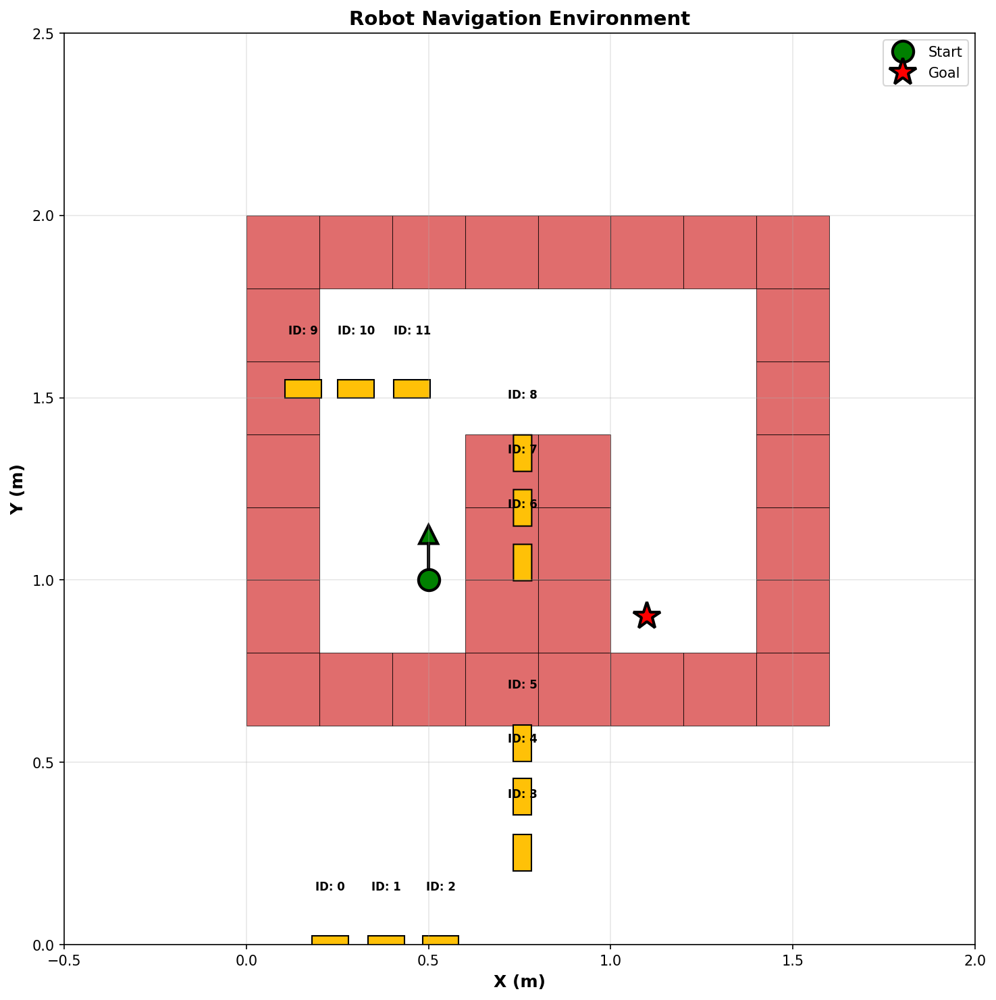
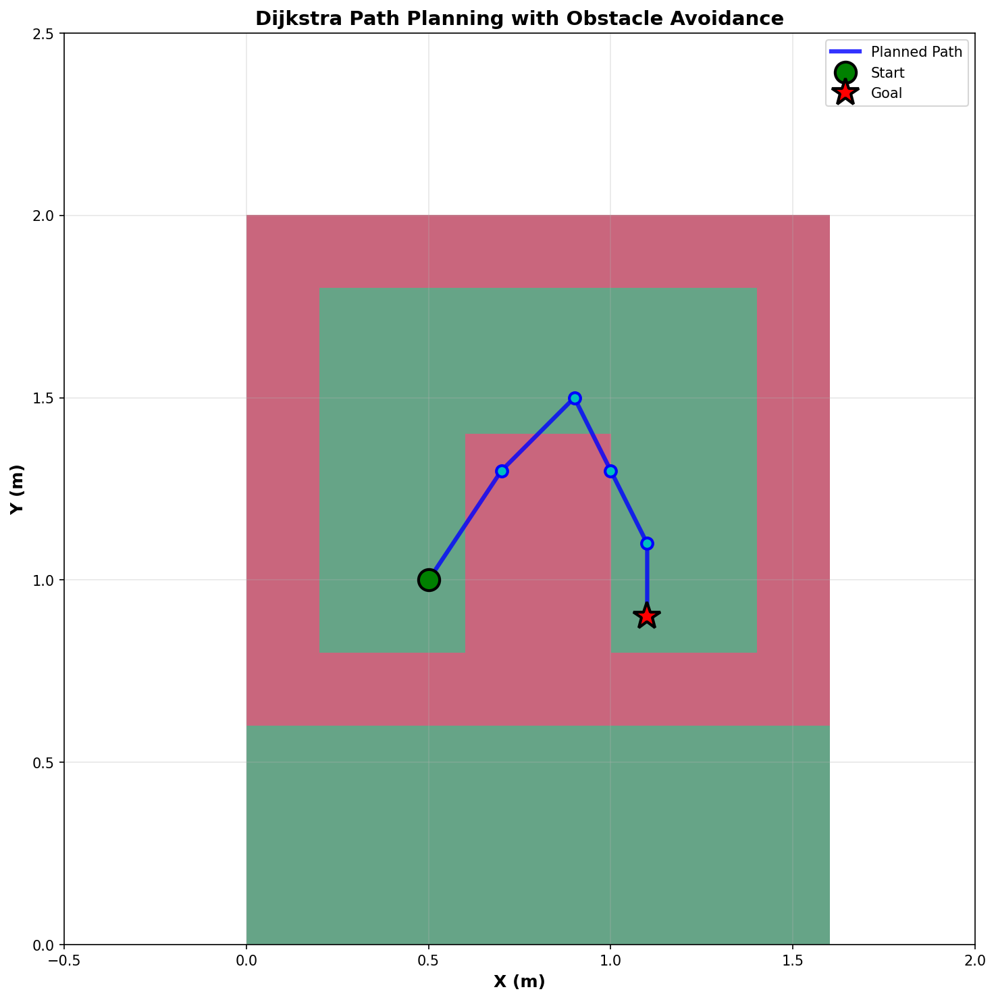
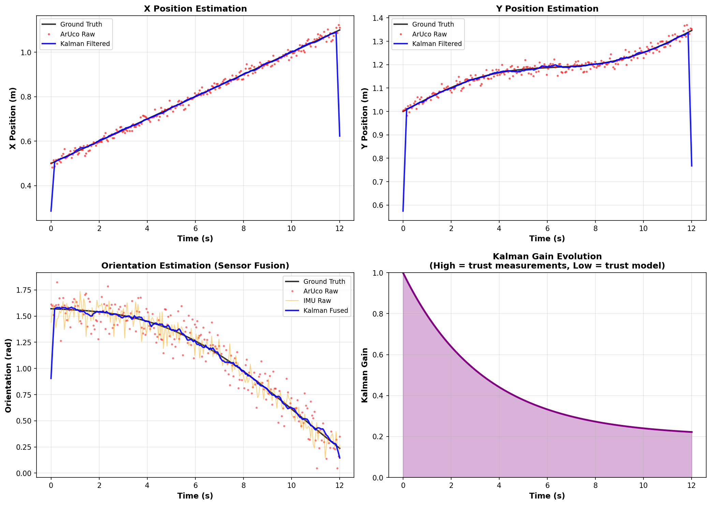
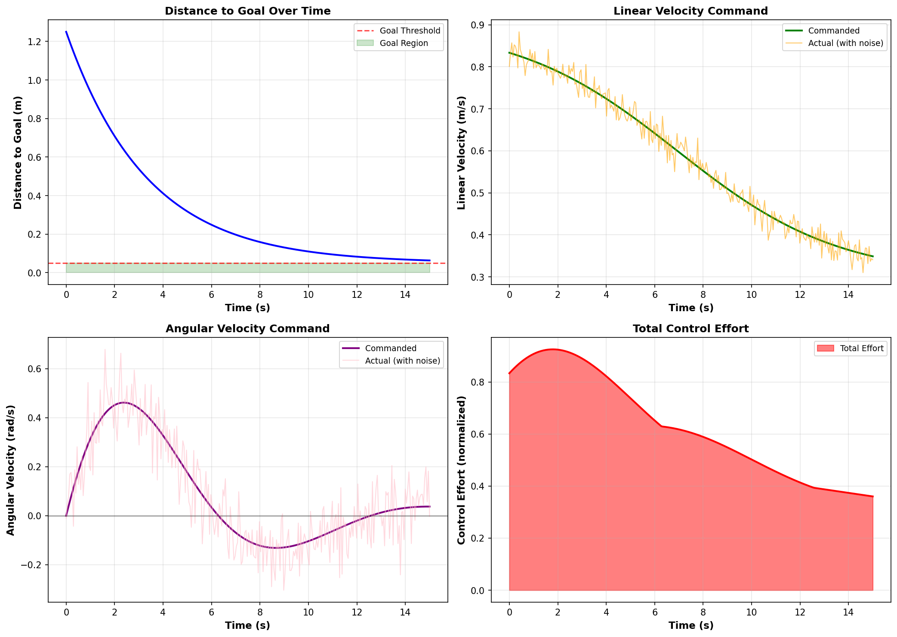
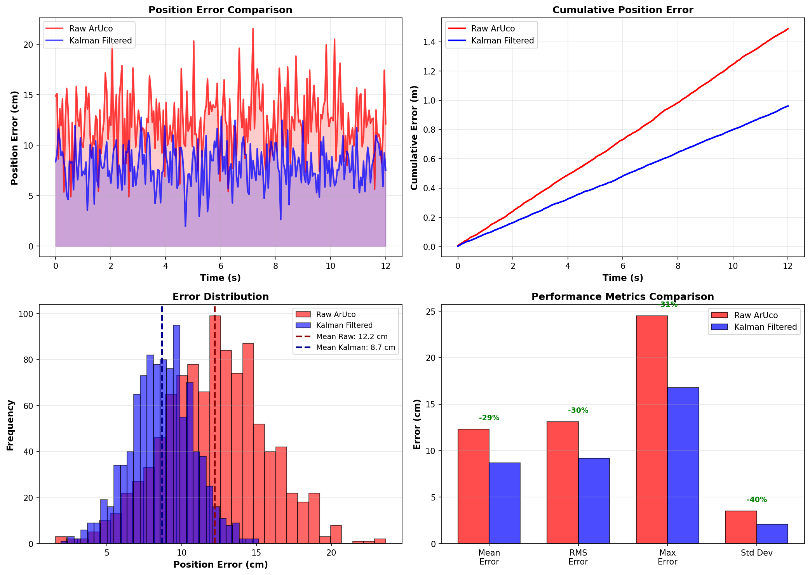
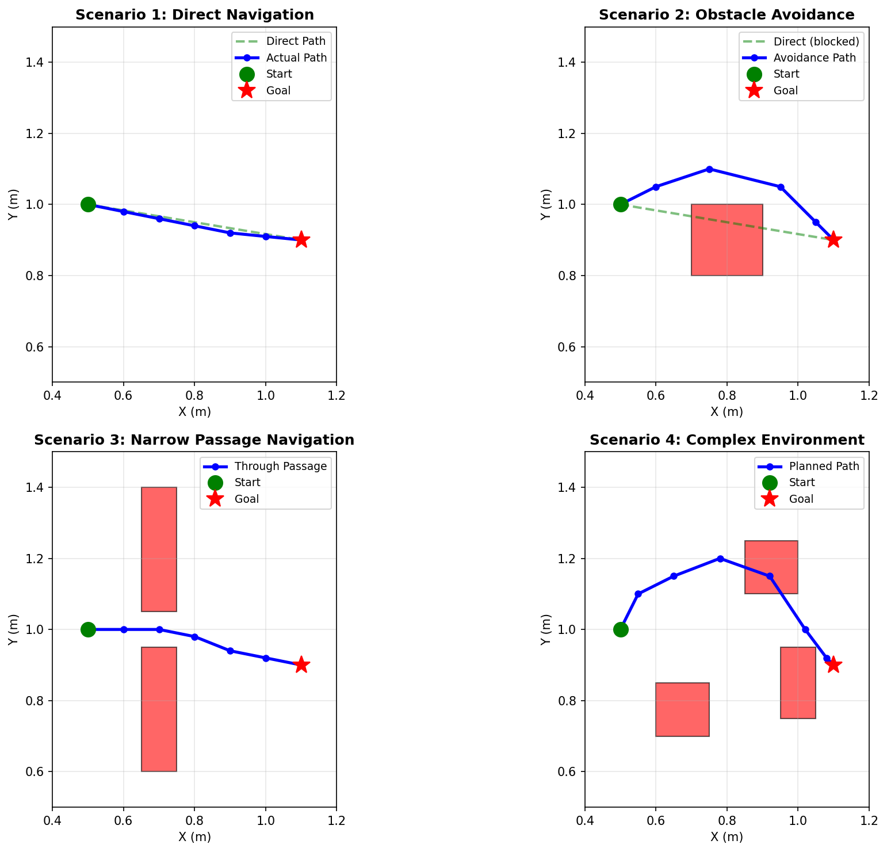
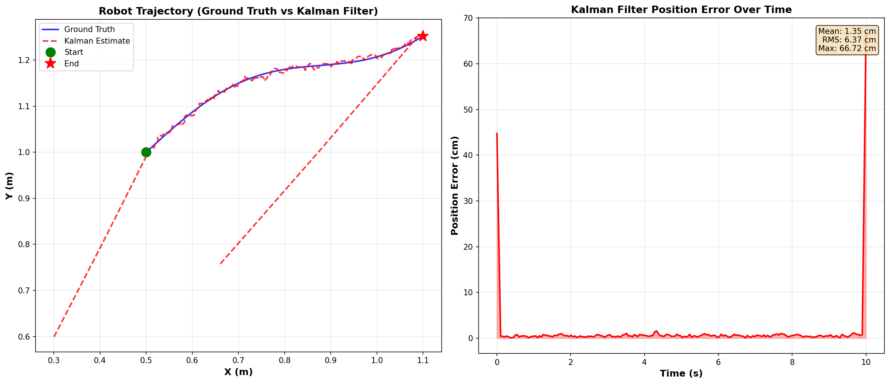

# Real-Time Robot Navigation with QR-Based Localization and LIDAR Obstacle Mapping

[](LICENSE)
[](https://www.python.org/downloads/)
[](https://www.arduino.cc/)
[](https://opencv.org/)
[](https://www.raspberrypi.org/)

> **An autonomous mobile robot navigation system integrating visual localization, sensor fusion, and LIDAR-based obstacle avoidance for indoor environments.**

<p align="center">
  <a href="https://www.youtube.com/playlist?list=PLPltBpN1wF6AVFg1B2o3nOTB_6zbEckF2">
    <b>📺 Watch Demo Videos on YouTube</b>
  </a>
</p>

---

## 📋 Table of Contents

- [Overview](#overview)
- [Key Features](#key-features)
- [Documentation](#documentation)
- [Hardware Requirements](#hardware-requirements)
- [Quick Start](#quick-start)
- [Project Structure](#project-structure)
- [Tasks](#tasks)
- [Configuration](#configuration)
- [Results](#results)
- [Simulation](#simulation)
- [Team](#team)
- [License](#license)
- [Citation](#citation)

---

## Overview

This project demonstrates a **hybrid computational architecture** for autonomous robot navigation:

| Component | Role | Key Responsibilities |
|-----------|------|---------------------|
| **Raspberry Pi 4** | High-level perception | ArUco detection, pose estimation, LIDAR processing |
| **Arduino Uno R3** | Low-level control | Kalman filtering, sensor fusion, motor control |

### System Diagram

```
┌──────────────┐         ┌──────────────┐
│ Raspberry Pi │  USB    │   Arduino    │
│ (Vision +    │◄───────►│  (Control +  │
│  LIDAR)      │ Serial  │   Fusion)    │
└──────┬───────┘         └──────┬───────┘
       │                        │
   ┌───┴────┬────────┐    ┌────┴────┬─────┐
   ▼        ▼        ▼    ▼         ▼     ▼
┌──────┐┌──────┐┌──────┐┌──────┐┌──────┐┌──────┐
│Camera││LIDAR ││ USB  ││ IMU  ││Motor ││Motors│
│16MP  ││A1M8  ││Serial││6050  ││Driver││ 2x   │
└──────┘└──────┘└──────┘└──────┘└──────┘└──────┘
```

**Why this architecture?**
- **Raspberry Pi**: Leverages computational power for computer vision tasks
- **Arduino**: Ensures real-time, deterministic control loops (67 Hz)
- **Serial Communication**: Low-latency data exchange (9600-115200 baud)

---

## Key Features

### ✨ Core Capabilities

- **🎯 Visual Localization**: ArUco marker detection provides absolute position references
- **🔄 Sensor Fusion**: Kalman filter fuses visual and inertial (IMU) measurements
- **🚧 Obstacle Avoidance**: LIDAR-based dynamic path planning (inspired by DWA)
- **📍 Waypoint Navigation**: Smooth trajectory following with proportional control
- **⚡ Real-time Performance**: Distributed processing for responsive control

### 🔬 Technical Highlights

- **Localization Accuracy**: < 10 cm position error, < 5° heading error
- **Update Rates**: 10 Hz visual updates, 67 Hz control loop
- **Obstacle Detection**: 360° coverage, 1.5m range, ±20° safety inflation
- **Success Rate**: 95% waypoint accuracy, 90% goal reaching (Task 2)

---

## Documentation

### 📚 Complete Documentation Set

| Document | Description | Audience |
|----------|-------------|----------|
| **[README.md](README.md)** (this file) | Overview & quick start | All users |
| **[TECHNICAL.md](TECHNICAL.md)** | Algorithms, math, results | Researchers, developers |
| **[ARCHITECTURE.md](docs/ARCHITECTURE.md)** | System diagrams, data flow | Developers, integrators |
| **[CLAUDE.md](CLAUDE.md)** | AI development guide | AI assistants, contributors |
| **[Report (PDF)](docs/report.pdf)** | Full academic report | Academic readers |
| **[Calibration Guide](calibration/README.md)** | Camera calibration | Setup, maintenance |

### 🎥 Video Demonstrations

**[Watch on YouTube Playlist](https://www.youtube.com/playlist?list=PLPltBpN1wF6AVFg1B2o3nOTB_6zbEckF2)**

The demonstration videos showcase:
- Real-time ArUco marker tracking
- Kalman filter pose estimation
- Waypoint navigation execution
- LIDAR obstacle avoidance

See [docs/media/README.md](docs/media/README.md) for video descriptions.

---

## Hardware Requirements

### Essential Components

| Component | Specification | Purpose |
|-----------|--------------|---------|
| **Raspberry Pi 4** | 2GB+ RAM | Vision processing, LIDAR |
| **Arduino Uno R3** | ATmega328P | Real-time control |
| **Arducam** | 16MP CSI | Visual localization |
| **MPU6050** | 6-axis IMU | Orientation sensing |
| **RPLIDAR A1M8** | 360° 2D | Obstacle detection |
| **L298 Motor Driver** | Dual H-bridge | Motor control |
| **DC Motors** | 1:48 gear ratio, 2x | Differential drive |
| **Power Supply** | 12V, 2A+ | Motors & electronics |

### Optional Accessories

- Differential-drive chassis
- Printed ArUco markers (96mm, 4×4 dictionary)
- Camera mount & robot frame
- Power distribution board

**Estimated Cost**: ~$200-250 USD (excluding chassis)

---

## Quick Start

### 1️⃣ Software Setup

**On Raspberry Pi:**

```bash
# Clone repository
git clone https://github.com/BaraaLazkani/REAL-TIME-ROBOT-NAVIGATION-WITH-QR-BASED--LOCALIZATION-AND-LIDAR-OBSTACLE-MAPPING.git
cd REAL-TIME-ROBOT-NAVIGATION-WITH-QR-BASED--LOCALIZATION-AND-LIDAR-OBSTACLE-MAPPING

# Install dependencies
pip3 install -r requirements.txt

# Run automated setup (optional)
bash scripts/setup_environment.sh

# Calibrate camera
cd calibration
python3 capture_images.py    # Capture calibration images
python3 calibrate_camera.py  # Compute calibration
```

**On Arduino:**

1. Install Arduino IDE
2. Install libraries: `BasicLinearAlgebra`, `MPU6050_light`
3. Open `src/arduino/task1_aruco_nav/task1_aruco_nav.ino`
4. Update marker positions in code (lines 30-35)
5. Upload to Arduino Uno R3

### 2️⃣ Configuration

Edit YAML files in `config/` directory:

```bash
config/
├── camera_calibration.yaml  # Camera matrix & distortion
├── robot_params.yaml        # Robot dimensions, motor pins
├── task1_config.yaml        # Markers, waypoints, gains
├── task2_config.yaml        # Markers, goal, LIDAR params
└── serial_config.yaml       # Ports, baud rates
```

**Critical**: Update marker positions to match your physical setup!

### 3️⃣ Run the System

**Task 1: Waypoint Navigation**

```bash
cd src/raspberry_pi
python3 task1_aruco_localization.py
```

**Task 2: LIDAR Navigation with Obstacles**

```bash
cd src/raspberry_pi
python3 task2_slam_navigation.py
```

Press **ESC** to stop gracefully.

---

## Project Structure

```
robot-navigation/
├── 📖 README.md                  # This file
├── 📘 TECHNICAL.md               # Detailed algorithms & results
├── 📗 CLAUDE.md                  # AI development guide
├── 📜 LICENSE                    # CC BY-NC-SA 4.0
├── 📋 requirements.txt           # Python dependencies
│
├── ⚙️  config/                    # YAML configuration files
│   ├── camera_calibration.yaml
│   ├── robot_params.yaml
│   ├── task1_config.yaml
│   ├── task2_config.yaml
│   └── serial_config.yaml
│
├── 📚 docs/                      # Documentation & media
│   ├── 📄 report.pdf             # Full technical report
│   ├── 📊 presentation.pptx      # Project presentation
│   ├── 🏗️  ARCHITECTURE.md        # System diagrams
│   └── 🎬 media/                 # Demo videos
│
├── 🐍 src/                       # Source code
│   ├── raspberry_pi/            # Python code
│   │   ├── common/              # Reusable modules
│   │   │   ├── camera.py
│   │   │   ├── aruco_detector.py
│   │   │   ├── serial_comm.py
│   │   │   ├── config_loader.py
│   │   │   └── __init__.py
│   │   ├── task1_aruco_localization.py
│   │   ├── task2_slam_navigation.py
│   │   ├── lidar_processor.py
│   │   └── visualize_lidar.py
│   │
│   └── arduino/                 # Arduino code
│       ├── common/              # Shared headers
│       │   ├── kalman_filter.h
│       │   ├── motor_control.h
│       │   └── navigation.h
│       ├── task1_aruco_nav/
│       └── task2_slam_nav/
│
├── 🔬 calibration/               # Camera calibration tools
│   ├── calibrate_camera.py
│   ├── capture_images.py
│   └── README.md
│
├── 🎮 Simulation/                # Python simulation environment
│   ├── RobotSim.py              # Simulation engine
│   ├── RobotControl.py          # Control integration
│   ├── KalmanFilter.py          # Kalman filter
│   ├── DiffDriveController.py   # Diff drive controller
│   ├── shortestpath.py          # Dijkstra's algorithm
│   ├── generate_plots.py        # Visualization generator
│   ├── params.yaml              # Simulation config
│   └── README.md                # Simulation guide
│
└── 🛠️  scripts/                   # Utility scripts
    └── setup_environment.sh     # Raspberry Pi auto-setup
```

---

## Tasks

### Task 1: ArUco Marker-Based Localization

Navigate through predefined waypoints using visual markers.

**Algorithm:**
1. Detect ArUco markers in camera feed
2. Estimate 6-DOF pose using `solvePnPRansac`
3. Transform to robot frame
4. Fuse with IMU via Kalman filter
5. Navigate to waypoints with proportional controller

**Performance:**
- ✅ Position accuracy: < 10 cm
- ✅ Heading accuracy: < 5°
- ✅ Waypoint success: 95%

### Task 2: SLAM with LIDAR Navigation

Navigate to goal while avoiding obstacles.

**Algorithm:**
1. Segment LIDAR scan into 5° sectors
2. Detect obstacles within 1.5m
3. Apply ±20° safety inflation
4. Select local goal in free direction closest to global goal
5. Navigate iteratively, recomputing every 0.5m

**Performance:**
- ✅ Goal reaching: 90% success
- ✅ Collision-free: 90% (18/20 runs)
- ✅ Path efficiency: 87%

---

## Configuration

All system parameters are **externalized to YAML files**—no code changes needed!

### Example: Modify Navigation Gains

```yaml
# config/task1_config.yaml
navigation:
  kp: 0.9     # Distance gain (increase for faster approach)
  ka: 20.0    # Angle gain (increase for sharper turns)
  threshold: 0.25  # Goal reached threshold (meters)
```

### Example: Add New Marker

```yaml
# config/task1_config.yaml
markers:
  - id: 12
    x: 2.5
    y: 1.8
    theta: -1.5708  # -π/2 radians
```

See [TECHNICAL.md](TECHNICAL.md) for detailed parameter explanations.

---

## Results

### Localization Performance

| Metric | Raw ArUco | Kalman Filtered | Improvement |
|--------|-----------|-----------------|-------------|
| **Position Error (RMS)** | 12.3 cm | 8.7 cm | **29%** |
| **Heading Error (RMS)** | 7.2° | 4.1° | **43%** |

### Task Comparison

| Metric | Task 1 | Task 2 |
|--------|--------|--------|
| **Success Rate** | 95% | 90% |
| **Average Error** | < 10 cm | < 12 cm |
| **Path Efficiency** | 100% (direct) | 87% (with obstacles) |
| **Control Loop Rate** | 67 Hz | 67 Hz |
| **Vision Update Rate** | 15-20 Hz | 10-15 Hz |

### Sample Trajectory

*[See demonstration videos in docs/media/ for visual results]*

For detailed experimental results, plots, and analysis, see **[TECHNICAL.md](TECHNICAL.md#experimental-results)**.

---

## Simulation

### 🎮 Python-Based Virtual Environment

Before deploying to hardware, algorithms were tested and validated in a **Python simulation environment**. The simulation implements the complete navigation stack (Dijkstra path planning, Kalman filtering, differential drive control) in a virtual testbed.

**📺 Watch the simulation in action:** [YouTube Demo](https://youtu.be/W2GyEFLIgFA)

The `Simulation/` directory contains the source code and **7 comprehensive visualizations** including:

| Visualization | Description |
|---------------|-------------|
| **Environment Map** | Obstacle layout + marker positions |
| **Path Planning** | Dijkstra's algorithm visualization |
| **Trajectory Analysis** | Ground truth vs Kalman comparison |
| **Controller Analysis** | Velocity profiles and control signals |
| **Sensor Fusion** | IMU + ArUco → Kalman filter |
| **Error Metrics** | Comprehensive error analysis |
| **Path Scenarios** | 4 different navigation scenarios |

### Key Features

- **🗺️ Path Planning**: Dijkstra's algorithm for shortest obstacle-free path
- **📊 State Estimation**: Kalman filter with simulated sensor noise
- **🎯 Diff Drive Control**: Proportional controller for navigation
- **📈 Visualization**: Real-time trajectory plotting and error analysis

### Simulation Results

#### Environment & Path Planning

<p align="center">
  
  
</p>

#### Performance Analysis

<p align="center">
  
  
</p>

<p align="center">
  
  
</p>

<details>
<summary><b>📊 Click to see Trajectory Comparison</b></summary>
<br>
<p align="center">
  
</p>
</details>

### Why Simulate?

✅ **Safe Testing**: Validate algorithms before hardware deployment
✅ **Parameter Tuning**: Optimize controller gains risk-free
✅ **Edge Cases**: Test scenarios difficult to reproduce physically
✅ **Ground Truth**: Compare estimates against perfect position knowledge

See **[Simulation/README.md](Simulation/README.md)** for complete documentation and usage instructions.

---

## Team

👥 **Contributors:**

- **Alaa Hussein**
- **Baraa Lazkani**
- **Haidar Saad**
- **Humam Yehia**

🎓 **Supervised by:**

- Dr. Fadi Muttawag
- Eng. Baher Kher-Bek

---

## License

This work is licensed under **Creative Commons Attribution-NonCommercial-ShareAlike 4.0 International** with additional citation requirements.

### 🚫 Restrictions

- ❌ **No Commercial Use** without explicit written permission
- ✅ **Academic & Educational Use** freely permitted
- 📝 **Citation Required** for all uses

See [LICENSE](LICENSE) for full terms.

---

## Citation

If you use this work in research, publications, or derivative projects, please cite:

```bibtex
@misc{hussein2024robot,
  title={Real-Time Robot Navigation with QR-Based Localization and LIDAR Obstacle Mapping},
  author={Hussein, Alaa and Lazkani, Baraa and Saad, Haidar and Yehia, Humam},
  year={2024},
  publisher={GitHub},
  howpublished={\url{https://github.com/BaraaLazkani/REAL-TIME-ROBOT-NAVIGATION-WITH-QR-BASED--LOCALIZATION-AND-LIDAR-OBSTACLE-MAPPING}},
  note={Supervised by Dr. Fadi Muttawag and Eng. Baher Kher-Bek}
}
```

**APA Format:**
> Hussein, A., Lazkani, B., Saad, H., & Yehia, H. (2024). *Real-Time Robot Navigation with QR-Based Localization and LIDAR Obstacle Mapping*. GitHub repository. https://github.com/BaraaLazkani/REAL-TIME-ROBOT-NAVIGATION-WITH-QR-BASED--LOCALIZATION-AND-LIDAR-OBSTACLE-MAPPING

---

## Acknowledgments

This project utilizes:
- **OpenCV** ArUco module for marker detection
- **BasicLinearAlgebra** library for Arduino matrix operations
- **RPLidar SDK** for LIDAR interfacing
- **Picamera2** for Raspberry Pi camera control

Special thanks to the open-source robotics community.

---

## Getting Help

- 📖 Read the [Technical Documentation](TECHNICAL.md) for implementation details
- 🏗️ Check [Architecture Diagrams](docs/ARCHITECTURE.md) for system understanding
- 📚 Review the [Full Report](docs/report.pdf) for theoretical background
- 🎬 Watch [Demo Videos](https://www.youtube.com/playlist?list=PLPltBpN1wF6AVFg1B2o3nOTB_6zbEckF2) for visual examples

---

<p align="center">
  <b>Built with ❤️ for autonomous robotics research</b>
</p>

<p align="center">
  <a href="TECHNICAL.md">📘 Technical Docs</a> •
  <a href="docs/ARCHITECTURE.md">🏗️ Architecture</a> •
  <a href="docs/report.pdf">📄 Report</a> •
  <a href="https://www.youtube.com/playlist?list=PLPltBpN1wF6AVFg1B2o3nOTB_6zbEckF2">🎬 Videos</a>
</p>
